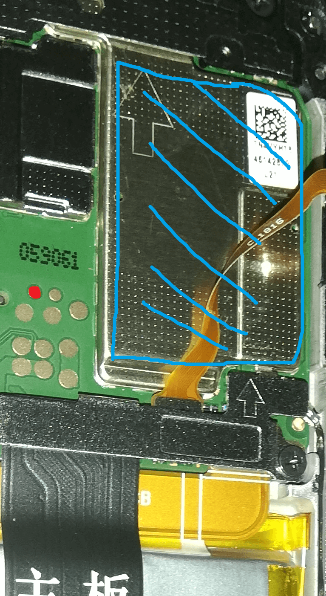

# Guide how to unlock the bootloader of a Huawei P20 lite

So you want to unlock the bootloader of you Huawei P20 lite (Codename: anne; ANE-LX1)?

Well since there is no longer a official method ([Huawei closed their unlock service back in 2018](https://www.xda-developers.com/huawei-stop-providing-bootloader-unlock-codes/)),
a unofficial method needs to be used.

The only options that doesn't invole some creepy third party software that requires you to pay a few bucks is [PotatoNV](https://github.com/mashed-potatoes/PotatoNV). 
However this requires you to open your phone.

## Preparations
* At first you need something to open your phone. You can buy many different phone repair kits online, however what you at least need is
  * a hairdryer to warm up the glue under the backcover
  * a suction cup to lift the cover
  * at least one thin plectrum to lossen the glue
  * some new glue to close the backcover again later
* A PC and a USB cable to connect the phone to the computer
* Something that conducts electricty like tweezers

## Step by Step
1. Open your phone with the above tools. There are some good YT videos available online. Just search for something like ``Huawei P20 lite battery replacement`` ([Example video](https://www.youtube.com/watch?v=E1fsb9Jws60)).
2. Once your phone is open follow the [PotatoNV guide](https://github.com/mashed-potatoes/PotatoNV) Note: There is also a [YT video](https://www.youtube.com/watch?v=YK9dlYUM6NM) available that explains how it is done very good
  * Here a graphic that displays the LLD points 
  

## Further References
* https://www.xda-developers.com/huawei-honor-bootloader-unlock-potatonv/
